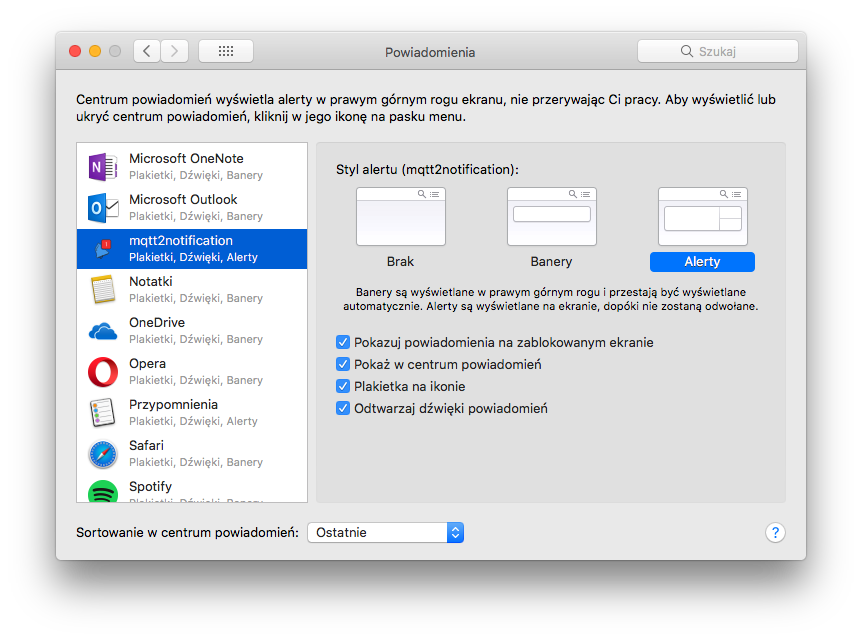

# Install
Download newest version from https://github.com/macbury/mqtt2notification/releases and place it in Applications directory

# How it works
https://www.youtube.com/watch?v=JfGdwLK64co&feature=youtu.be

# Mqtt message format
Publish valid json to mqtt topic:
```json
{ "title": "Title of notification", "message": "Content of message" }
```

# Build
```shell
pip install -r requirements.txt
bin/build
bin/run
```

# Caveats
To enable actions on the notification (the buttons that allow the user to select an option), open System Preferences > Notifications, select mqtt2notification in the sidebar, and select the "Alerts" alert style. 


# Icons from

https://www.iconfinder.com/icons/2246841/bell_notification_one_notification_tiwtter_icon#size=128
https://www.iconfinder.com/icons/2236309/alert_bell_notification_twitter_icon#size=128
